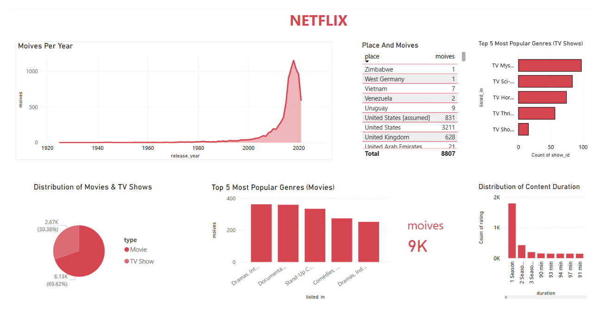

#  Netflix Content Analysis Dashboard (Power BI)

##  Project Overview
This project focuses on analyzing Netflix’s content library using **Power BI** to uncover trends and insights related to movies and TV shows.  
The dashboard provides a clear understanding of content distribution, popular genres, release trends, country-wise production, and duration & ratings patterns.

---

##  Objective
The main objectives of this project are:
- To analyze the distribution of **Movies vs TV Shows**
- To identify **popular genres**
- To study **release year trends**
- To understand **country-wise content production**
- To analyze **ratings and content duration**

---

##  Dataset
- **Source:** Netflix Movies and TV Shows dataset (Kaggle)
- **Attributes Used:**
  - Title
  - Type (Movie / TV Show)
  - Genre
  - Release Year
  - Country
  - Rating
  - Duration

---

##  Tools & Technologies
- **Power BI** – Data visualization and dashboard creation  
- **Power Query** – Data cleaning and transformation  

---

##  Data Preparation & Cleaning
The following steps were performed before building the dashboard:
- Removed duplicate and null records
- Split the *Genre* column to analyze individual genres
- Standardized country names
- Filtered only relevant columns required for analysis

---

##  Dashboard Features
The Power BI dashboard includes:
- **Movies vs TV Shows Distribution**
- **Top 5 Genres (Movies & TV Shows)**
- **Content Release Trends by Year**
- **Country-wise Content Distribution**
- **Content Duration & Ratings Analysis**

---

##  Key Insights
- **Movies dominate Netflix**, accounting for ~70% of total content
- **Drama and Comedy** are the most popular genres
- Netflix content growth increased significantly **after 2010**
- The **USA leads content production**, followed by the UK and India
- Most TV shows have **only one season**
- Most movies have a duration of **90–100 minutes**

---

##  Recommendations
- Expand content in **Sci-Fi and Thriller** genres
- Increase production in **non-English-speaking countries**
- Focus on **multi-season TV shows** for better audience engagement
- Maintain a balance between **content quality and quantity**

---

##  Power BI Dashboard Screenshot
Below is a snapshot of the Power BI dashboard:

> 

---

## Conclusion
This dashboard provides actionable insights into Netflix’s content strategy and highlights key trends that can help improve content planning and audience engagement using data-driven decisions.

---

##  Author
**Khyathy Yadav**  
Artificial Intelligence & Data Science
